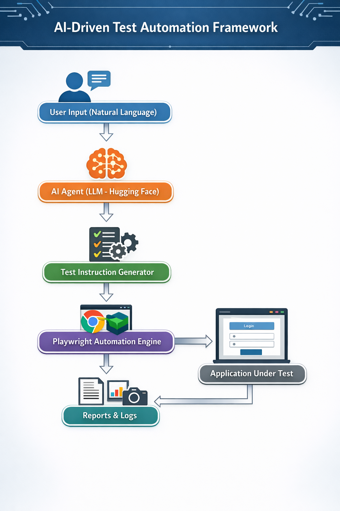

# 🚀 AI-Powered Test Automation Framework

An intelligent test automation framework that leverages AI agents to generate, execute, and self-heal test cases from natural language using Playwright and Python.

---

## 🔥 Overview

This project demonstrates how AI can transform traditional test automation by reducing manual scripting and improving test resilience.

Instead of writing brittle test scripts, users can provide test scenarios in plain English, and the AI agent dynamically converts them into executable browser actions.

---

## ✨ Key Features

- 🤖 **Natural Language Testing**
  - Convert plain English steps into executable test automation

- 🌐 **UI Automation with Playwright**
  - Automates real browser interactions (Chromium)

- 🔁 **Self-Healing Mechanism**
  - Automatically retries failed locators using fallback strategies

- 🔗 **API + UI Integration**
  - Supports end-to-end testing workflows

- 📊 **Test Reporting**
  - Generates HTML reports with execution results

- ⚙️ **CI/CD Integration**
  - Automated test execution using GitHub Actions

---

## 🧠 Architecture

### 📌 System Flow



---

## 🛠 Tech Stack

- Python  
- Playwright  
- Pytest  
- Hugging Face (Free LLM API)  
- Requests (API testing)  
- GitHub Actions (CI/CD)

---

## ▶️ How to Run

### 1. Clone the repo
```bash
git clone https://github.com/<your-username>/ai-test-framework.git
cd ai-test-framework```

### 2. Create Virtual Environment
```bash
python -m venv venv

# Windows (Git Bash)
source venv/Scripts/activate

# Windows (PowerShell)
.\venv\Scripts\Activate.ps1```

### 3. Install Dependencies
```bash
pip install -r requirements.txt
python -m playwright install```

### 4. Add the API key in the .env file
### 5. Run tests with the following test sample
- Go to https://the-internet.herokuapp.com/login  
- Enter tomsmith into username  
- Enter SuperSecretPassword! into password  
- Click login


